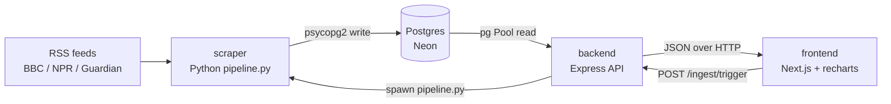

# News Pulse

A full-stack news topic-clustering timeline: a Python scraper ingests RSS feeds,
extracts full article bodies, dedupes by URL, and groups articles into clusters;
a Node/Express backend serves those clusters and a timeline from a shared hosted
Postgres database; a Next.js frontend renders a clickable timeline of clusters and
the articles in the one you pick.

---

## 1. Overview

News Pulse watches three news RSS feeds (BBC, NPR, The Guardian World), pulls each
article's full body, stores the lot in a single Postgres database, and groups
articles that are about the same story into **clusters**. The web UI shows those
clusters on a timeline (bar height = article count, ordered by start time) and
lists the articles in any cluster you click. A **Refresh data** button kicks off a
fresh scrape+cluster run on demand; the backend reports progress via a job-status
poll, and the timeline repopulates when the run finishes.

It is a take-home assessment project — deliberately simple, deterministic, and
explainable rather than a sophisticated NLP pipeline.

---

## 2. Features

- **Multi-source RSS ingestion** from BBC, NPR, and The Guardian (World), normalised
  into one article shape despite per-feed field/date differences.
- **Full-article body extraction** with a graceful fallback so a single bad page
  never loses the article.
- **URL-based dedup** so repeated runs never insert the same article twice.
- **Incremental ingestion**: only new URLs are fetched/inserted; the corpus grows
  across runs while existing rows are untouched.
- **Topic clustering** via IDF-weighted keyword overlap + DBSCAN (large corpus) or
  union-find (small corpus), rebuilt from scratch every run.
- **Timeline API** that returns cluster size, time span, and a normalised
  intensity value ready for charting.
- **On-demand ingestion** through `POST /ingest/trigger` + a `jobId` status poll,
  so the UI can refresh data without a separate scheduler.
- **Cluster detail view** with a per-source filter applied client-side.
- **Live deployment** across Vercel (frontend), Render (backend), and Neon (DB).

---

## 3. Architecture / How It Works

Three services plus one shared database. The scraper and backend are decoupled —
they never call each other directly except for one bridge: the backend can **spawn
the scraper** as a child process to satisfy the "Refresh data" button.



**Data flow:**

1. `scraper/pipeline.py` parses all feeds (`feeds.parse_feeds`), normalises each
   item, extracts the body (`feeds.extract_body`), and inserts non-duplicate rows
   (`db.insert_article`, `ON CONFLICT (url) DO NOTHING`).
2. It then loads every article (`db.fetch_all_articles`) and clusters them
   (`clustering.cluster_articles`), wiping and rebuilding the `clusters` +
   `cluster_articles` tables in one transaction (`db.replace_clusters`).
3. The Express backend reads the same tables and exposes them over HTTP
   (`/clusters`, `/clusters/:id`, `/timeline`, `/sources`).
4. `POST /ingest/trigger` spawns `pipeline.py` as a child process (`jobs.js`),
   returns a `jobId` immediately, and the frontend polls `/ingest/status/:jobId`
   every 2 s until `status === "done"`, then reloads the timeline.
5. Both the scraper (psycopg2) and the backend (node-postgres `Pool`) point at the
   **same** `DATABASE_URL` (Neon pooled connection string).

---

## 4. Tech Stack

| Layer         | Language / Runtime      | Framework / Library                                                       |
| ------------- | ----------------------- | ------------------------------------------------------------------------- |
| Scraper       | Python 3.10+            | feedparser, trafilatura, beautifulsoup4, python-dateutil, psycopg2-binary |
| Backend API   | Node.js 18+             | Express 4, node-postgres (`pg`) 8, cors, dotenv                           |
| Frontend      | JavaScript (Next.js 14) | React 18, recharts 2, Tailwind CSS 3                                      |
| Database      | —                       | PostgreSQL, hosted on Neon (PgBouncer pooled endpoint)                    |
| Backend host  | —                       | Render (Node web service) / Docker                                        |
| Frontend host | —                       | Vercel (Next.js)                                                          |

---

## 5. Setup & Installation

The scraper and backend share **one Postgres database** via `DATABASE_URL`.
Provision a free Neon database (see DEPLOY.md) or point at any Postgres instance.

```bash
cp .env.example .env          # at the project root
# edit .env: paste your DATABASE_URL (Neon pooled connection string)
```

### Scraper (Python 3.10+)

```bash
cd scraper
python -m venv .venv
# Windows: .venv\Scripts\activate   | macOS/Linux: source .venv/bin/activate
pip install -r requirements.txt
python pipeline.py             # ingest + cluster, prints a summary, exits 0/1
```

### Backend (Node 18+)

```bash
cd backend
npm install
npm start                      # http://localhost:4000
```

### Frontend (Next.js 14)

```bash
cd frontend
npm install
npm run dev                    # http://localhost:3000
```

Open http://localhost:3000, click **Refresh data** to trigger an ingest, and the
timeline repopulates when the scraper finishes. (For local non-TLS Postgres, set
`PGSSLMODE=disable`.)

### Environment variables

| Variable              | Where           | Default                 | Purpose                                              |
| --------------------- | --------------- | ----------------------- | ---------------------------------------------------- |
| `DATABASE_URL`        | root `.env`     | _(required)_            | Neon pooled Postgres connection string               |
| `PORT`                | backend         | `4000`                  | Backend listen port (`10000` on Render)              |
| `NEXT_PUBLIC_API_URL` | frontend `.env` | `http://localhost:4000` | Browser-visible backend base URL                     |
| `CLUSTER_THRESHOLD`   | scraper         | `3`                     | Min shared significant words (small-corpus fallback) |
| `PGSSLMODE`           | both            | `require`               | `disable` for local non-TLS Postgres                 |
| `PG_POOL_MAX`         | backend         | `10`                    | Max concurrent node-postgres connections             |
| `PYTHON_BIN`          | backend         | auto-detected           | Absolute python path for the spawned scraper         |

---

## 6. Usage

### Run the scraper directly

```bash
cd scraper && python pipeline.py
```

Printed summary:

```
=== News Pulse run complete in 12.3s ===
  feed items parsed : 94
  new articles      : 87
  duplicates skipped: 7
  empty body (kept) : 3
  total in db       : 540
  clusters          : 6
```

### Key endpoints (backend)

```bash
curl http://localhost:4000/healthz                                   # {"ok":true}
curl http://localhost:4000/timeline                                  # chart-shaped rows
curl http://localhost:4000/clusters                                  # list with size + span
curl http://localhost:4000/clusters/3                                # one cluster's articles
curl http://localhost:4000/sources                                   # ["BBC","Guardian","NPR"]
curl -X POST http://localhost:4000/ingest/trigger                    # {"jobId":"…"}  (HTTP 202)
curl http://localhost:4000/ingest/status/<jobId>                     # {"status":"running"} → "done"
```

### Trigger ingestion from the UI

Click **Refresh data** in the frontend header. It posts to `/ingest/trigger`,
polls `/ingest/status/:jobId` every 2 s, and reloads the timeline when the job is
`done`.

---

## 7. Project Structure

```
news/
├── db/
│   └── schema.sql            # shared Postgres DDL (applied by both services at boot)
├── .env.example              # shared env (DATABASE_URL, PORT, NEXT_PUBLIC_API_URL, …)
├── README.md                 # this file
├── PROJECT.md                # engineering tradeoffs for technical reviewers
├── DEPLOY.md                 # step-by-step deploy guide (Neon + Render + Vercel)
├── VIVA.md                   # anticipated viva Q&A
├── scraper/                  # Python ingest + clustering pipeline
│   ├── pipeline.py           # entry point: ingest → cluster → summary
│   ├── feeds.py              # RSS parsing + body extraction (trafilatura + BS4 fallback)
│   ├── clustering.py         # IDF-weighted overlap + DBSCAN / union-find clustering
│   ├── db.py                 # Postgres writes via psycopg2
│   ├── envload.py            # zero-dep root .env loader (never overrides real env)
│   └── requirements.txt
├── backend/                  # Node/Express API
│   ├── server.js             # async routes over a pg Pool
│   ├── db.js                 # pg Pool + idempotent schema init
│   ├── jobs.js               # in-memory ingest job runner (spawns pipeline.py)
│   ├── package.json
│   ├── render.yaml           # Render blueprint (backend web + scraper worker)
│   └── Dockerfile            # container build bundling Node + Python + scraper
└── frontend/                 # Next.js App Router + Tailwind + recharts
    ├── app/page.jsx          # main page (timeline + panel + source filter + refresh)
    ├── app/api.js            # fetch wrapper (NEXT_PUBLIC_API_URL, error parsing)
    ├── app/layout.js         # root layout + metadata
    ├── components/Timeline.jsx    # recharts bar chart, click → select cluster
    ├── components/ClusterPanel.jsx# right-hand detail list with source filter
    ├── vercel.json           # Vercel config (framework=nextjs)
    └── package.json
```

---

## 8. Topic Grouping Approach

**Method:** IDF-weighted keyword-overlap similarity, clustered with **DBSCAN** for
corpora of ≥ 30 articles, falling back to a raw shared-token-count threshold +
union-find for smaller corpora. This is the **keyword-overlap family**, not an
embedding/semantic model — the constants below are read straight from
`clustering.py`.

**Tokenisation** (`tokenize`): lowercase, strip HTML tags and URLs, split on
`[a-z0-9]+`, keep only tokens of length ≥ 5 that are not in the inline stopword or
domain-token lists and not purely numeric.

**Large-corpus path (n ≥ `MIN_CORPUS` = 30):**

1. Smoothed IDF per token: `idf = log((n + 1) / df)`.
2. Hard document-frequency ceiling: tokens with `df > max(2, ceil(n * MAX_DF_FRAC))`
   are excluded from the IDF vocabulary (`MAX_DF_FRAC = 0.08`). This strips the
   generic news-vocabulary tail (`world`, `country`, `police`, …).
3. Pairwise IDF similarity via an inverted index; pairs must share ≥
   `MIN_SHARED_TOKENS` (= 3) surviving tokens.
4. Distance `d = 1 / (1 + S)` and **DBSCAN** with `DBSCAN_EPS = 0.05`,
   `DBSCAN_MIN_SAMPLES = 2`. A core point needs ≥ 2 neighbours within `eps`;
   bridging articles that fail the density test become noise and are dropped.

**Small-corpus path (n < 30):** IDF is unreliable, so two articles are linked when
they share ≥ `CLUSTER_THRESHOLD` raw significant tokens (default 3, overridable via
env), and union-find derives connected components.

**Cluster label:** the 3 most frequent significant tokens across member articles,
joined by `/` (e.g. `toxic / report / maternity`).

**Why these numbers:** DBSCAN's tight `eps` (0.05 ⇒ very high required similarity)
plus the `≥ 3` shared-token guard keeps clusters to genuinely-coherent stories and
prevents the single-linkage-style chaining that the earlier union-find path
suffered (where A~B and B~C merged A/B/C even if A and C shared nothing). The
two-tier design avoids relying on IDF when the corpus is too small for it to be
meaningful. See `PROJECT.md §2` for the full rationale.

**One limitation evident from the code:** clusters are **rebuilt from scratch every
run** (`TRUNCATE … RESTART IDENTITY CASCADE` in `db.replace_clusters`). Cluster ids
are not stable across runs, and the pairwise pass is O(n²) per run — fine for a few
thousand articles, not for tens of thousands. (`PROJECT.md §3`.)

---

## 9. Stack & Decision Tradeoffs

A condensed view; the full write-up is `PROJECT.md`. For each choice: **picked**,
**alternative**, **why**, **downside**.

| Decision                     | Picked                                                                                  | Alternative                                       | Why                                                                                                                               | Downside                                                                                                           |
| ---------------------------- | --------------------------------------------------------------------------------------- | ------------------------------------------------- | --------------------------------------------------------------------------------------------------------------------------------- | ------------------------------------------------------------------------------------------------------------------ |
| **Database**                 | Hosted Postgres (Neon)                                                                  | SQLite / Mongo                                    | Persistent, shared by two services via one URL, survives redeploys, concurrent writers, `ON CONFLICT` upserts, pooled connections | External dependency; cold-start latency on first connection; made all backend handlers `async`                     |
| **Python DB driver**         | psycopg2                                                                                | psycopg3 / asyncpg                                | Synchronous, fits the straight-line ingest→cluster flow; mature                                                                   | Not async (scraper doesn't need it)                                                                                |
| **Node DB driver**           | node-postgres (`pg`) Pool                                                               | Prisma / Drizzle                                  | Thin, direct SQL control over the timeline joins                                                                                  | No ORM conveniences; raw SQL strings                                                                               |
| **Clustering approach**      | IDF-weighted overlap + DBSCAN                                                           | Embeddings + HDBSCAN; raw count overlap           | Deterministic, debuggable, zero ML deps, good enough for "same story across outlets"                                              | No semantic understanding; synonyms/paraphrase won't link; transitive chaining in the small-corpus union-find path |
| **Clustering rebuild model** | Full wipe each run                                                                      | Incremental with stable ids                       | Always internally consistent; simple code                                                                                         | O(n²) per run; ids not stable across runs                                                                          |
| **Body extraction**          | trafilatura, BS4 `<p>` fallback                                                         | newspaper3k; Playwright                           | trafilatura is purpose-built for news; BS4 fallback means a failed page never loses the article                                   | trafilatura pulls lxml (compiled C dep)                                                                            |
| **Dedup**                    | `articles.url UNIQUE` + `ON CONFLICT DO NOTHING`                                        | Cross-source story merge (MinHash/SimHash)        | Faithful corpus; dedup is exact, never over-merges                                                                                | A wire story run by two outlets is two rows; merging happens only via clustering                                   |
| **Ingest trigger**           | `spawn(pipeline.py)` + in-memory job state                                              | BullMQ/Redis; managed queue (Inngest, SQS+Lambda) | Zero infrastructure; ~60 lines in `jobs.js`                                                                                       | State in RAM (lost on restart); single-process only; two rapid triggers run twice                                  |
| **Scheduling**               | None (manual trigger / direct run)                                                      | Render Cron Job hourly                            | Kept scope minimal for the assessment                                                                                             | Clusters only refresh when someone triggers a run                                                                  |
| **Backend framework**        | Express 4                                                                               | Fastify / Next.js route handlers                  | Minimal, ubiquitous, simple async handlers                                                                                        | None material for this size                                                                                        |
| **Frontend framework**       | Next.js 14 (App Router)                                                                 | CRA / Vite + React                                | File-based routing, Vercel-native deploy                                                                                          | Slightly more machinery than a SPA needs                                                                           |
| **Charting**                 | recharts 2                                                                              | visx / D3 / ECharts                               | Declarative React components, responsive container, click handlers — timeline is ~80 lines                                        | No true Gantt-style span bars; we encode magnitude as bar height/colour                                            |
| **Styling**                  | Tailwind CSS 3                                                                          | CSS Modules / styled-components                   | Utility-first, no context switching, tiny CSS                                                                                     | Class strings get long                                                                                             |
| **CORS**                     | `app.use(cors())` (permissive)                                                          | Restrictive origin allowlist                      | Vercel + Render cross-origin "just works" out of the box                                                                          | Open to any origin (single-user tool)                                                                              |
| **Schema ownership**         | `db/schema.sql`, applied by both services at boot                                       | Scraper owns DDL; backend duplicates inline       | Single source of truth; no drift                                                                                                  | Both services must be able to read the file at boot                                                                |
| **Env loading**              | shared root `.env` via `dotenv` (backend) and a zero-dep loader (`envload.py`, scraper) | Per-service env files                             | Both services read identical config; real env always wins                                                                         | One file shared across services                                                                                    |

---

## 10. Migration Notes (SQLite → Neon Postgres)

The project was migrated from a local SQLite file (`data/.db`) to hosted Postgres
on Neon. What changed and why:

- **DDL** (`db/schema.sql`): `INTEGER PRIMARY KEY AUTOINCREMENT` → `SERIAL PRIMARY
KEY`; `TEXT` retained (Postgres `TEXT` is unbounded, same semantics); uniqueness
  on `articles.url` preserved; added `ON DELETE CASCADE` on `cluster_articles` FKs
  and three indexes (`published_at`, `source`, `cluster_articles.article_id`).
- **Shared schema**: `db/schema.sql` is now the single source of truth, applied
  idempotently (`CREATE … IF NOT EXISTS`) by **both** `scraper/db.py` and
  `backend/db.js` at boot. Previously the scraper owned the schema and the backend
  ran a duplicate inline DDL — that drift risk is gone.
- **Driver swap**: `sqlite3` → `psycopg2` (scraper) and `node:sqlite`/better-sqlite
  → `node-postgres` (`pg`) `Pool` (backend). The public function names
  (`connect`, `init_schema`, `insert_article`, `url_exists`, `fetch_all_articles`,
  `replace_clusters`) are unchanged, so `pipeline.py` and `clustering.py` needed no
  edits.
- **Dedup primitive**: SQLite `lastrowid`/`INSERT OR IGNORE` → Postgres
  `INSERT … ON CONFLICT (url) DO NOTHING RETURNING id`.
- **Rebuild primitive**: SQLite `DELETE FROM sqlite_sequence` reset → Postgres
  `TRUNCATE … RESTART IDENTITY CASCADE` (which also wipes `cluster_articles` via
  the FK cascade and restarts the `SERIAL`).
- **URL normalisation**: both drivers rewrite a `postgres://` scheme to
  `postgresql://` (Heroku/Render ship the former, which the drivers reject).
- **TLS**: Postgres on Neon requires TLS; `sslmode=require` is the default in both
  drivers, overridable to `disable` via `PGSSLMODE` for local non-TLS Postgres.
- **Backend became async**: `pg` returns Promises, so every route handler is now
  `async` — a small but touch-every-endpoint change.
- **Residual stale config**: `backend/render.yaml` still hardcodes
  `DATABASE_URL: ./data/news.db` and `DB_PATH: ./data/news.db` and references a
  persistent-disk model — leftovers from the SQLite era that do **not** reflect the
  current Postgres behaviour and would need correcting before a Render Blueprint
  deploy (use DEPLOY.md's manual steps instead).

---

## 11. Deployment

Based on the actual config files:

| Component | Host                                        | Why (from config)                                                                                                                                                                                                                             |
| --------- | ------------------------------------------- | --------------------------------------------------------------------------------------------------------------------------------------------------------------------------------------------------------------------------------------------- |
| Frontend  | **Vercel**                                  | `frontend/vercel.json` declares `framework: nextjs`, `buildCommand: npm run build`, `outputDirectory: .next`. Next.js is Vercel-native.                                                                                                       |
| Backend   | **Render** (Node web service) **or** Docker | `backend/render.yaml` defines a Node web service (`news-pulse-backend`, `runtime: node`, `healthCheckPath: /healthz`, `npm install` / `npm start`). `backend/Dockerfile` bundles Node 20 + Python + scraper deps for an all-in-one container. |
| Scraper   | **Render worker** (or spawned by backend)   | `render.yaml` defines a Python `worker` service; alternatively `POST /ingest/trigger` spawns `pipeline.py` in-process. No scheduled cron is implemented.                                                                                      |
| Database  | **Neon** (Postgres)                         | Both services connect via the shared `DATABASE_URL` (Neon pooled `-pooler` endpoint); no on-host DB file.                                                                                                                                     |

**Secrets/env vars** are managed per-platform (Render/Vercel dashboards) and never
committed (`.gitignore` excludes `.env`). The backend reads its env via `dotenv`
pointing at the root `.env`; the scraper uses `envload.py`, which loads the same
root `.env` but never overrides values already present in the real environment, so
platform-injected vars always win. The frontend needs `NEXT_PUBLIC_API_URL` (the
`NEXT_PUBLIC_` prefix is mandatory so the value is inlined into the browser bundle
at build time). Full copy-paste runbook: **DEPLOY.md**.

---

## 12. Known Limitations / Future Improvements

Evident from code/`PROJECT.md`, not invented:

- **No scheduler.** Ingestion is manual (the Refresh button or `python pipeline.py`);
  no cron is wired up, despite DEPLOY.md describing a Render Cron Job as an option.
- **Cluster ids are not stable** across runs (full rebuild each time), so deep
  links like `/clusters/42` are fragile after a refresh (`PROJECT.md §3`).
- **O(n²) clustering** each run — fine for thousands of articles, not tens of
  thousands.
- **In-memory job state** (`jobs.js`) is lost on backend restart and is
  single-process only; two rapid triggers run two scrapers (`PROJECT.md §5`).
- **No semantic clustering** — synonyms/paraphrases won't link; only exact token
  overlap does.
- **Stale UI footer text**: `frontend/app/page.jsx` still reads _"keyword-overlap
  union-find clustering (threshold = 3)"_, which describes the small-corpus path
  only; the large-corpus path is DBSCAN. Cosmetic, but inaccurate.
- **Stale `render.yaml`** values (`./data/news.db`) from the SQLite era — see
  Migration Notes.
- **Permissive CORS** (`app.use(cors())`) — acceptable for a single-user tool, not
  for production multi-tenant use.

## Sources

- BBC News — http://feeds.bbci.co.uk/news/rss.xml
- NPR — https://feeds.npr.org/1001/rss.xml
- The Guardian (World) — https://www.theguardian.com/world/rss
